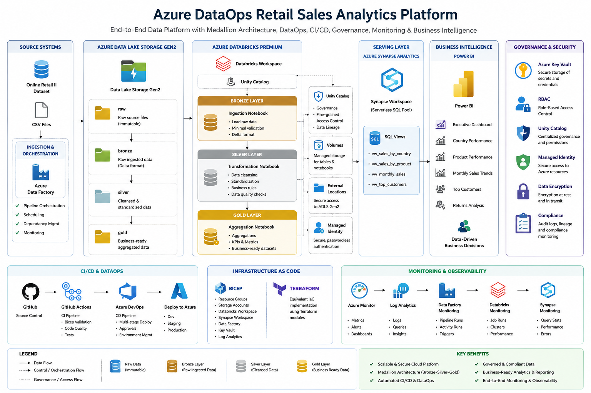

# Azure DataOps Retail Sales Analytics Platform

## Project Overview

This project is an end-to-end Azure DataOps and Modern Data Platform implementation built using Microsoft Azure services and DataOps engineering best practices.

The solution demonstrates how enterprise organisations can build a scalable, secure, governed, and automated analytics platform to ingest, process, store, and analyse retail sales data using a Lakehouse architecture, Infrastructure-as-Code, CI/CD automation, testing frameworks, monitoring, and business intelligence reporting.

The project uses the Online Retail II dataset and implements a complete Medallion Architecture (Bronze, Silver, Gold) deployed on Azure.

---

## Business Scenario

A fictional retail organisation requires a modern cloud data platform capable of:

* Ingesting retail sales transactions
* Storing data within a secure Azure Data Lakehouse
* Implementing Bronze, Silver and Gold data layers
* Providing curated business-ready datasets
* Supporting self-service analytics and reporting
* Automating infrastructure deployment
* Enforcing data quality and governance
* Monitoring platform performance and operational health
* Supporting Dev, Staging and Production environments

---

## Solution Architecture

The platform follows a modern Azure DataOps architecture:

Raw Data Source

↓

Azure Data Lake Storage Gen2

↓

Databricks Bronze Layer

↓

Databricks Silver Layer

↓

Databricks Gold Layer

↓

Azure Synapse Analytics (Serverless SQL)

↓

Power BI

### Azure Services Used

* Azure Data Lake Storage Gen2 (ADLS Gen2)
* Azure Databricks Premium Workspace
* Unity Catalog
* Azure Synapse Analytics
* Azure Data Factory
* Azure Key Vault
* Azure Log Analytics
* Azure Monitor
* Azure DevOps
* GitHub Actions
* Power BI

---

## Medallion Architecture

### Bronze Layer

Purpose:

* Raw data ingestion
* Minimal transformations
* Historical preservation
* Auditability

Example:

* online_retail_transactions

### Silver Layer

Purpose:

* Data cleansing
* Standardisation
* Business rule implementation
* Data quality enforcement

Transformations:

* Customer ID standardisation
* Country standardisation
* Sales amount calculation
* Transaction type classification
* Duplicate removal

### Gold Layer

Purpose:

* Business-ready analytics datasets
* Reporting optimisation
* Aggregated KPI generation

Gold Outputs:

* Sales By Country
* Sales By Product
* Monthly Sales
* Top Customers

---

## Infrastructure as Code

This project demonstrates Infrastructure-as-Code using both Microsoft-native and industry-standard deployment approaches.

### Deployment Options

#### Bicep

Microsoft-native Infrastructure-as-Code used as the primary deployment mechanism.

#### Terraform

Industry-standard multi-cloud Infrastructure-as-Code implementation included to demonstrate equivalent infrastructure provisioning capabilities.

---

## Azure Resources Deployed

The infrastructure deployment provisions:

* Azure Resource Group
* Azure Data Lake Storage Gen2
* Raw Container
* Bronze Container
* Silver Container
* Gold Container
* Azure Databricks Workspace
* Azure Synapse Analytics Workspace
* Azure Data Factory
* Azure Key Vault
* Azure Log Analytics Workspace
* User Assigned Managed Identity
* Azure Databricks Access Connector
* Unity Catalog Storage Credential
* Unity Catalog External Location
* Unity Catalog Volume
* Role-Based Access Control (RBAC)

---

## Environment Strategy

The solution supports multiple deployment environments:

### Development

* parameters.dev.json

### Staging

* parameters.stg.json

### Production

* parameters.prod.json

Environment deployments are automated through Infrastructure-as-Code templates.

---

## Data Orchestration

Azure Data Factory orchestrates the end-to-end processing workflow:

ADF Pipeline

↓

Bronze Ingestion Notebook

↓

Silver Transformation Notebook

↓

Gold Aggregation Notebook

↓

Synapse Analytics Serving Layer

---

## Analytics Layer

Azure Synapse Analytics Serverless SQL is used as the enterprise serving layer.

The Gold Delta datasets are exposed through:

* vw_sales_by_country
* vw_sales_by_product
* vw_monthly_sales
* vw_top_customers

These views are consumed directly by Power BI.

---

## Reporting Layer

Power BI provides business reporting and analytics dashboards including:

* Executive Sales Dashboard
* Monthly Sales Trends
* Country Performance Analysis
* Product Performance Analysis
* Top Customer Analysis
* Return Transaction Analysis

---

## CI/CD

The project demonstrates enterprise deployment automation using:

### GitHub Actions

* Bicep validation
* Infrastructure deployment
* Automated testing

### Azure DevOps

* Multi-stage deployment pipelines
* Infrastructure promotion
* Environment management

---

## Testing Strategy

The project includes:

### Unit Testing

Validates transformation rules and business logic.

### Data Quality Testing

Validates data completeness, accuracy and consistency.

### Integration Testing

Validates Bronze, Silver and Gold pipeline outputs.

---

## Monitoring and Observability

Monitoring capabilities include:

* Azure Data Factory pipeline monitoring
* Databricks job monitoring
* Synapse query monitoring
* Azure Monitor
* Azure Log Analytics
* Cost monitoring
* Alerting and incident management

---

## Security and Governance

Security controls include:

* Managed Identity Authentication
* Unity Catalog Governance
* Azure RBAC
* Azure Key Vault
* Secure Storage Access
* Principle of Least Privilege

---

## Credits and Inspiration

This project was designed and implemented as an independent portfolio solution.

The architecture and engineering practices were inspired by industry-standard Azure DataOps, Data Lakehouse, and Modern Data Warehouse patterns, including Microsoft reference architectures and Azure best-practice guidance.

All implementation, documentation, infrastructure code, deployment automation, testing strategy, monitoring design, and business use cases were developed specifically for this portfolio project.

---

## Author

### Dele Fatoba

Azure Data Engineer | Microsoft Certified Data Engineer | DataOps Practitioner

Experienced Data Engineering professional with expertise in Azure Data Platform technologies, modern data architectures, cloud analytics, Infrastructure-as-Code, automation, and enterprise reporting solutions.

Specialising in Azure Data Factory, Azure Databricks, Azure Synapse Analytics, Power BI, DataOps, CI/CD, and modern Lakehouse architectures.

## Connect With Me

Thank you for taking the time to explore this project.

I am passionate about designing and implementing modern data platforms using Microsoft Azure, DataOps, Analytics Engineering, and Cloud Data Architecture. This repository represents a practical implementation of enterprise-grade data engineering concepts, including Infrastructure-as-Code, CI/CD automation, data quality frameworks, orchestration, monitoring, and business intelligence solutions.

If you would like to learn more about my work, discuss Azure Data Engineering, DataOps, Analytics, Cloud Architecture, or explore professional collaboration opportunities, I would be delighted to connect.

### Portfolio Website

Explore my portfolio, projects, technical case studies, and professional experience:

**Portfolio:** https://sites.google.com/view/delefatoba/home

### Email

For professional enquiries, collaboration opportunities, consulting engagements, or technical discussions:

**Email:** [delefatob@yahoo.co.uk](mailto:delefatob@yahoo.co.uk)

### Areas of Interest

* Azure Data Engineering
* Azure Data Factory
* Azure Databricks
* Azure Synapse Analytics
* DataOps and DevOps
* Data Warehousing and Lakehouse Architectures
* Power BI and Business Intelligence
* Cloud Data Platforms
* Analytics Engineering
* Infrastructure as Code (Bicep & Terraform)
* AI-Powered Data Engineering

Thank you for visiting this repository. Feedback, suggestions, and professional networking opportunities are always welcome.
